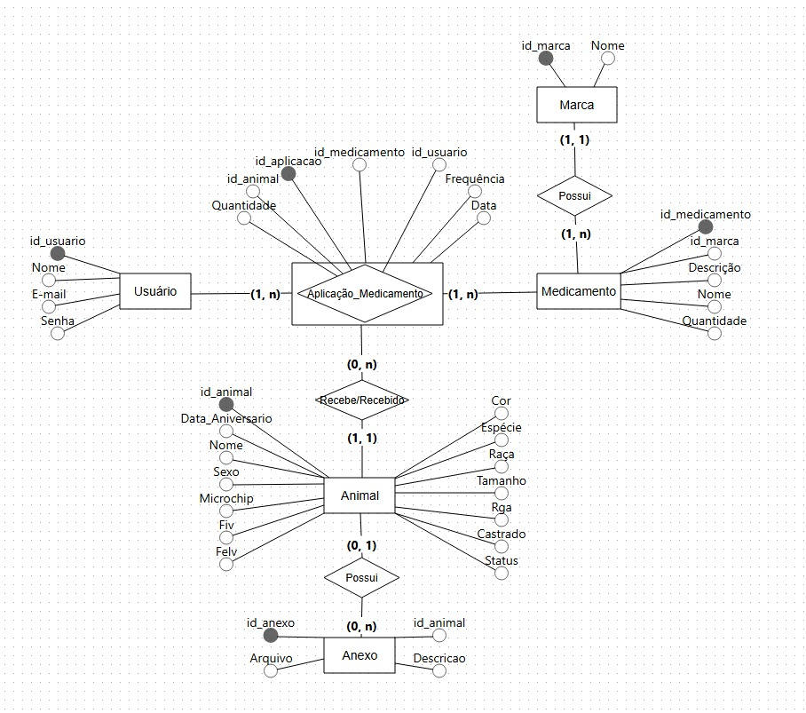
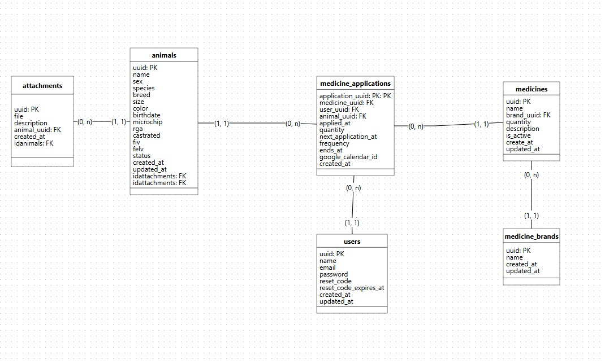
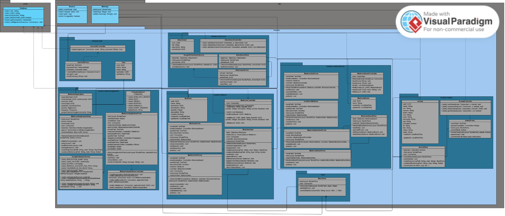
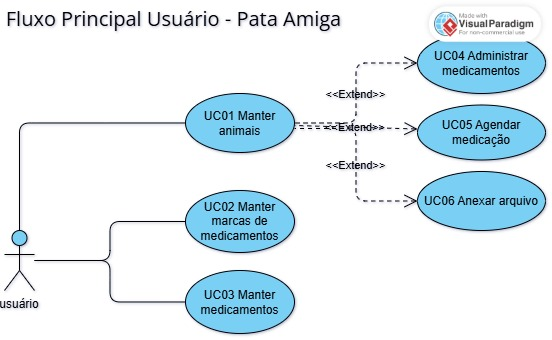
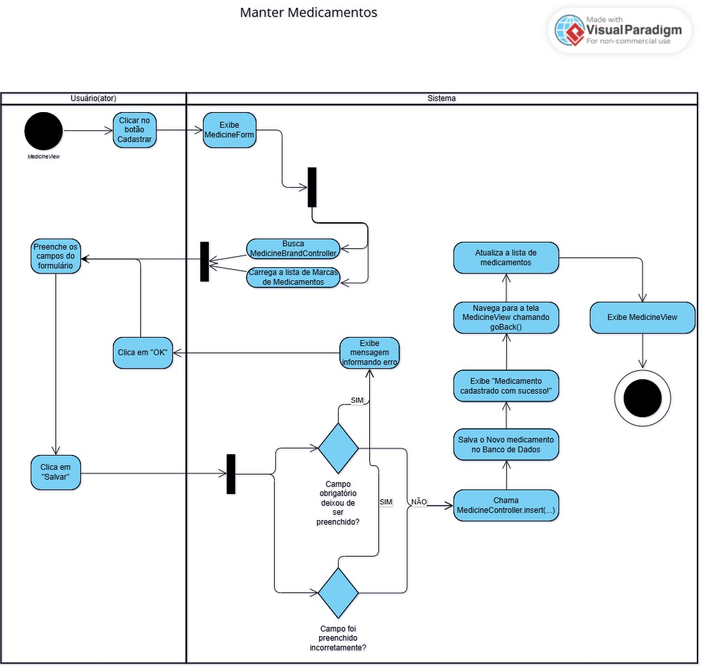
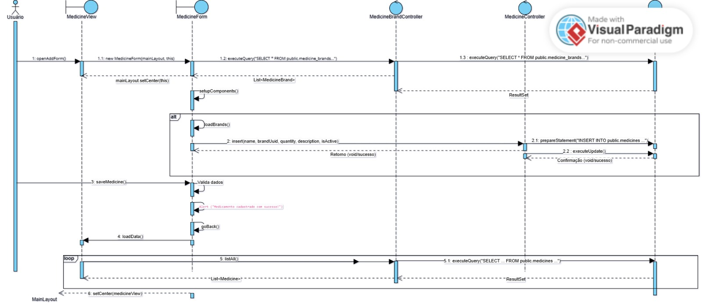

<h1 align="center" style="font-weight: bold;">Pata Amiga 🐾🐶</h1>

<p align="center">
 <a href="#technologies">Tecnologias</a> • 
 <a href="#description">Descrição</a> • 
 <a href="#database-models">Modelagens</a> • 
 <a href="#diagrams">Diagramas</a> • 
 <a href="#requirements">Requisitos</a> • 
 <a href="#installation">Instalação</a> •
 <a href="#commands">Comandos</a> •
 <a href="#collaborators">Colaboradores</a>
</p>

<h2 id="technologies">💻 Tecnologias</h2>

   

<h2 id="description">📚 Descrição</h2>

O projeto **Pata Amiga** é um sistema de gerenciamento para ONGs de animais. Ele foi desenvolvido para auxiliar no controle de informações relacionadas aos animais sob cuidados da ONG, oferecendo funcionalidades como:

- **Controle de Anexos**: Associações de documentos e arquivos a cada animal.
- **Gerenciamento de Medicamentos**: Registra medicamentos administrados aos animais e permite o agendamento de futuras aplicações.

<h2 id="database-models">🎲 Modelos do Banco de Dados</h2>

<h4><strong>Modelo Conceitual</strong></h4>
<a href=".github/assets/conceptual-database-model.jpeg">
  
</a>

<h4><strong>Modelo Lógico</strong></h4>
<a href=".github/assets/logic-database-model.jpeg">
  
</a>

<h2 id="diagrams">📄 Diagramas</h2>

<h4><strong>Diagrama de Classe</strong></h4>
<a href=".github/assets/class-diagram.jpeg">
  
</a>

<h4><strong>Diagrama de Caso de Uso</strong></h4>
<a href=".github/assets/use-case-diagram.jpeg">
  
</a>

<h4><strong>Narrativa do Caso de Uso</strong></h4>
<p>
  <a href=".github/assets/use-case-narrative.pdf">📄 Visualizar Narrativa do Caso de Uso (PDF)</a>
<p>

<h4><strong>Diagrama de Atividade</strong></h4>
<a href=".github/assets/activity-diagram.jpeg">
  
</a>

<h4><strong>Diagrama de Sequência</strong></h4>
<a href=".github/assets/sequence-diagram.jpeg">
  
</a>

<h2 id="requirements">📋 Requisitos</h2>

- **JDK 17** ou superior
- **Maven 3.6+** (para gerenciamento de dependências)
- **PostgreSQL 12+** (banco de dados)
- **IntelliJ IDEA** (recomendado) ou outra IDE Java
- **Variáveis de ambiente** configuradas:
  - `DB_URL` - URL de conexão do PostgreSQL (ex: `jdbc:postgresql://localhost:5432/friendly_paw`)
  - `DB_USER` - Usuário do banco de dados
  - `DB_PASSWORD` - Senha do banco de dados
  - `GOOGLE_CALENDAR_ID` - ID do Google Calendar (necessário para integração com o Google Calendar)
  - `GOOGLE_DRIVE_CLIENT_ID` - ID do cliente do Google Drive (necessário para integração com o Google Drive)
  - `GOOGLE_DRIVE_CLIENT_SECRET` - Segredo do cliente do Google Drive (necessário para integração com o Google Drive)

<h2 id="installation">⚙️ Instalação</h2>

1. **Clone este repositório:**
   ```bash
   git clone https://github.com/Quanty-IT/friendly-paw.git
   ```

2. **Configure as variáveis de ambiente:**
   
   No IntelliJ IDEA:
   - Vá em `Run` → `Edit Configurations...`
   - Selecione sua configuração de execução
   - Em `Environment variables`, adicione:
     ```
     DB_URL=jdbc:postgresql://localhost:5432/friendly_paw
     DB_USER=postgres
     DB_PASSWORD=sua_senha_aqui
     GOOGLE_CALENDAR_ID=id_do_google_calendar_aqui
     GOOGLE_DRIVE_CLIENT_ID=id_do_cliente_do_google_drive_aqui
     GOOGLE_DRIVE_CLIENT_SECRET=segredo_do_cliente_do_google_drive_aqui
     ```

4. **Instale as dependências Maven:**
   ```bash
   mvn clean install
   ```
   
   Ou no IntelliJ: Clique com botão direito no `pom.xml` → `Maven` → `Reload Project`

5. **Execute a aplicação:**
   
   Via Maven:
   ```bash
   mvn javafx:run
   ```
   
   Ou no IntelliJ:
   - Execute a classe `MainApp.java` (botão ▶️ ao lado do método `main`)

<h2 id="commands">💡 Comandos Úteis</h2>

  - <strong>Criar uma nova migration:</strong>
    ```bash
    javac -d out src/utils/CreateMigration.java
    java -cp out utils.CreateMigration migrationNameHere
    ```
  - <strong>Compilar o projeto:</strong>
    ```
    mvn compile
    ```
  - <strong>Executar a aplicação:</strong>
    ```bash
    mvn javafx:run
    ```
  - <strong>Limpar e recompilar:</strong>
    ```bash
    mvn clean compile
    ```

<h2 id="collaborators">🤝 Colaboradores</h2>

<table>
  <tr>
    <td align="center">
      <a href="https://github.com/victorozoterio">
        <br>
        <sub>
          <a href="https://github.com/victorozoterio">Victor Ozoterio</a>
        </sub>
      </a>
    </td>
    <td align="center">
      <a href="https://github.com/Murilocampoos">
        <br>
        <sub>
          <a href="https://github.com/Murilocampoos">Murilo Campos</a>
        </sub>
      </a>
    </td>
    <td align="center">
      <a href="https://github.com/PedroHDenny">
        <br>
        <sub>
          <a href="https://github.com/PedroHDenny">Pedro Denny</a>
        </sub>
      </a>
    </td>
     <td align="center">
      <a href="https://github.com/">
        <br>
        <sub>
          <a href="https://github.com/RafaTPz">Rafael Tadeu</a>
        </sub>
      </a>
    </td>
    <td align="center">
      <a href="https://github.com/">
        <br>
        <sub>
          <a href="https://github.com/marlon-greg">Margon Fanger</a>
        </sub>
      </a>
    </td>
  </tr>
</table>